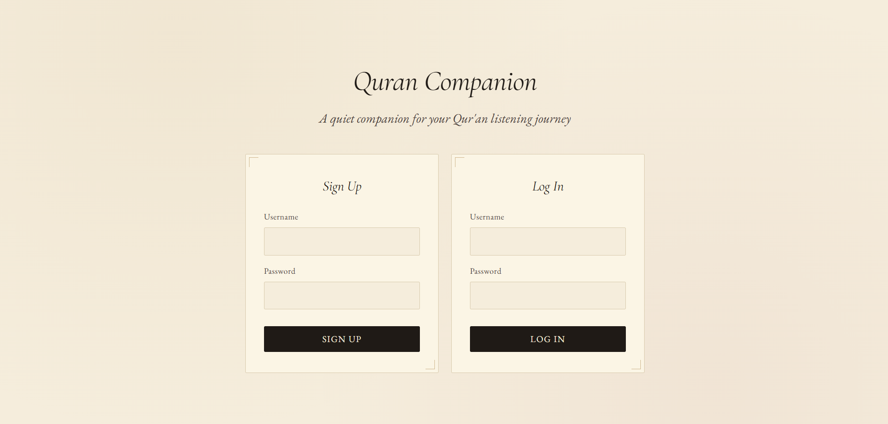
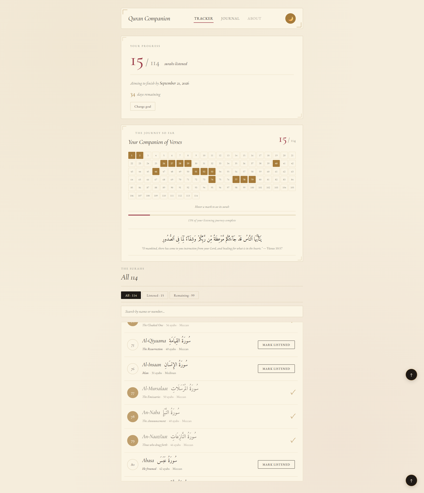
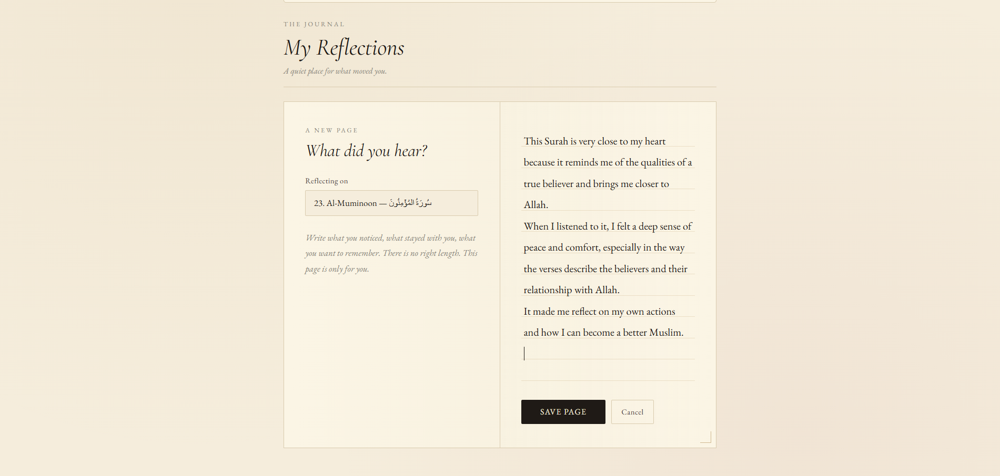
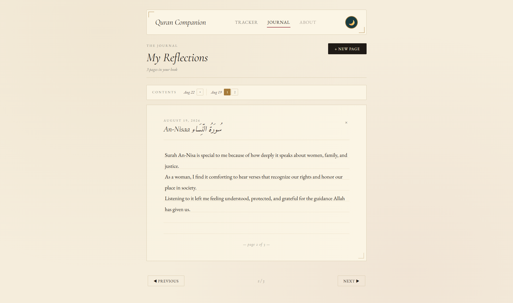

# Quran Companion

A motivational tracker and journal for your Qur'an listening journey.

**Live demo:** https://quran-companion-virid-chi.vercel.app

---

## Overview

Quran Companion is a full-stack web app that combines a progress tracker with a private space for reflection. Users can set a goal to finish listening to the whole Qur'an by a date that matters to them, track their progress through all 114 surahs, and keep a personal journal of their reflections along the way.

## Screenshots


*The login and signup page: the warm, book-inspired design sets the tone from the first screen.*


*The tracker: a goal card, a visual grid of all 114 surahs that fills in as you listen, and the full surah list with filters and search.*


*The journal writing view: a two-page book spread with a prompt on the left and lined writing paper on the right.*


*A saved reflection shown as a book page, with a contents strip above for jumping between entries by date.*

## Features

**Tracker** — Set a listening goal with a target date, mark surahs as listened one by one, and watch your progress fill in through a visual grid of all 114 surahs. Filter by all, listened, or remaining, and search by name or number.

**Reflection Journal** — After marking a surah as listened, you're gently asked if you want to reflect on it. Reflections are saved as pages in a private book, organized by date, with a book-style writing view meant to feel like an actual journal.

**Profile** — Set a display name and pick from nine Islamic-themed avatar icons and six colors.

**About Guide** — A welcome message greets new users the first time they log in, and an About link in the navbar explains the app anytime.

## Why I Built This

Most Qur'an apps focus only on tracking — how many surahs memorized, how many pages read. They miss the *reflection* side: actually thinking about what you read or heard. As a Software Engineering student specializing in UX, I wanted to build something that does both: real tracking, plus a simple, private space to write down what stuck with you.

The design was also a deliberate choice. Most Islamic apps use bright greens and generic modern styling. I wanted this one to feel more like an old book — warm, calm, personal — something you keep alongside the Qur'an rather than a typical productivity app.

## Tech Stack

- **Frontend:** React, JavaScript, CSS
- **Backend:** Python, Django, Django REST Framework
- **Database:** SQLite (development), PostgreSQL (production)
- **Authentication:** Token-based login via DRF
- **External API:** [Al Quran Cloud API](https://alquran.cloud/api) for verified surah data
- **Deployment:** Vercel (frontend), Render (backend)

## Key Design Decisions

**Getting the Qur'anic text right mattered most.** All surah names, translations, and details come from the Al Quran Cloud API — a trusted, established source — instead of being typed by hand. The text is treated with the care it deserves.

**The journal works like a book, not a feed.** Most journaling apps just stack entries as a scrolling list. This one uses a book layout instead: two pages while writing, one page while reading, and a contents strip grouped by date to navigate. It feels more personal and less like scrolling social media.

**Accessibility shaped the design choices.** Colors were chosen for strong contrast (dark text on a light background) so they're readable for people with low vision or color blindness. The font is spaced out for easier reading. Every interactive element has proper labels and works with a keyboard. These choices were guided by what I learned in Microsoft's Accessibility Fundamentals certification.

**Code is organized by feature, not by file type.** Each component's JavaScript and CSS files sit together in their own folder — for example, `Journal.js` and `Journal.css` both live in a `journal/` folder. This follows common React practice and makes the codebase easier to navigate.

## Future Roadmap

Features I'd like to add:

- Memorization and recitation tracking, not just listening
- Mood-based verse suggestions with translation and meaning
- Reminders and daily notifications
- Password reset via email
- A heart-shaped progress visual, inspired by the physical Qur'an trackers people print and color in
- A mobile app version
- Support for more languages

## Running Locally

You'll need Python 3.11+, Node.js, and Git installed.

### Backend

```bash
cd backend
python -m venv venv
venv\Scripts\activate            # Windows
# source venv/bin/activate       # Mac/Linux
pip install -r requirements.txt
python manage.py migrate
python manage.py load_surahs
python manage.py runserver
```

The backend runs at `http://127.0.0.1:8000`.

### Frontend

In a separate terminal:

```bash
cd frontend
npm install
npm start
```

The frontend runs at `http://localhost:3000`.

## Author

Built by Hafsa Ahmed as a personal project during the summer between first and second year of Software Engineering at the University of Guelph.
